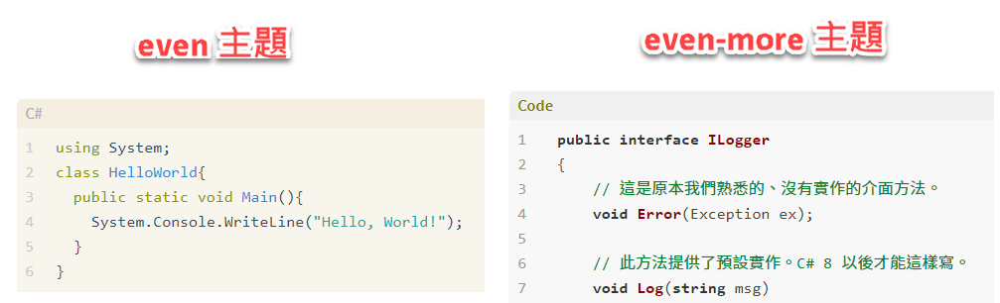
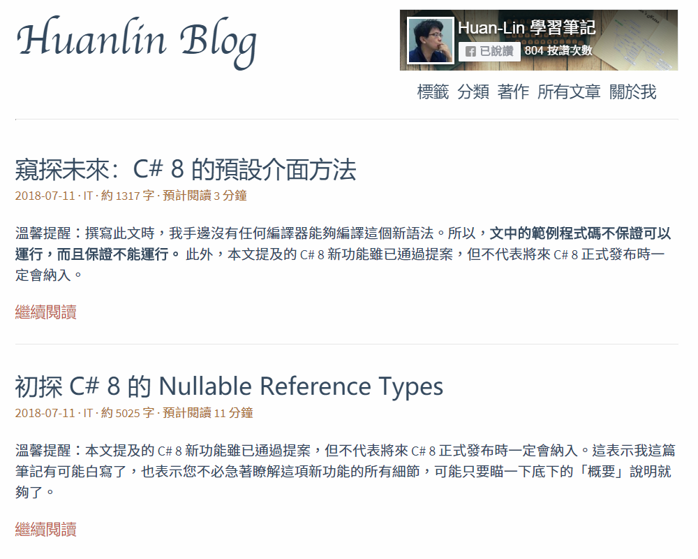
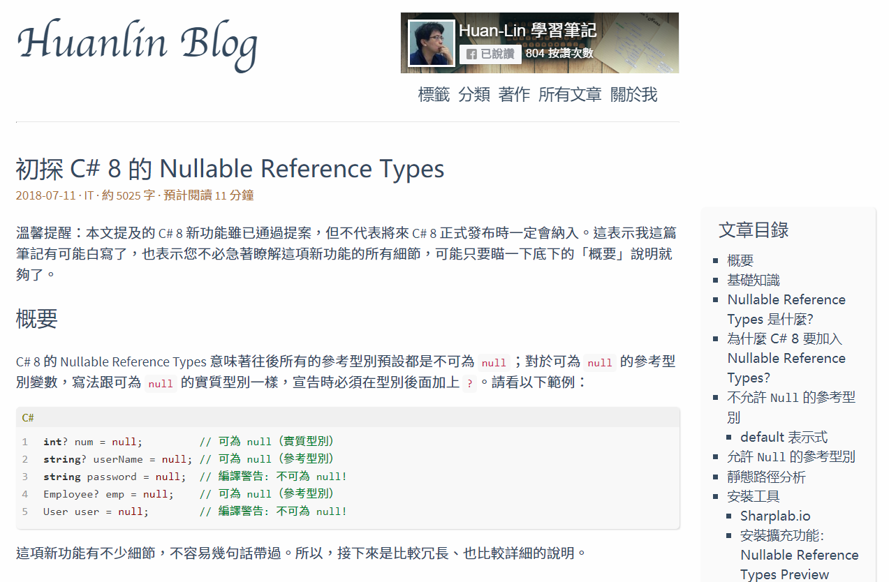
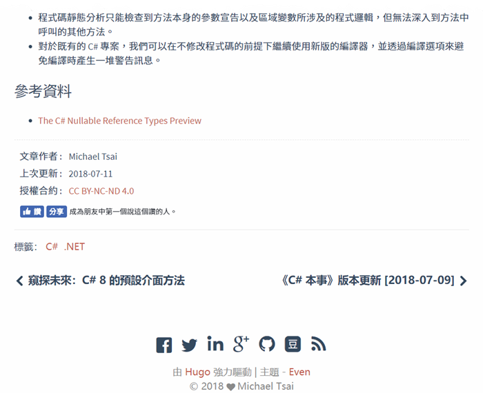

# hugo-theme-even-more

這是個極簡風格的 Hugo 主題（theme）。

> 此主題修改自 [hugo-theme-even](https://github.com/olOwOlo/hugo-theme-even)，而該主題又移植自 [hexo-theme-even](https://github.com/ahonn/hexo-theme-even)

你可以從我的部落格 [Huanlin Blog](https://www.huanlintalk.com/) 查看此主題所呈現出來的風格，或者瀏覽 [even 主題的範例網站](https://blog.olowolo.com/example-site/)。

## 與 even 主題的差異

我在 even 主題的基礎上做了一些修改，包括：

- 增加[繁體中文的字串資源](https://github.com/huanlin/hugo-theme-even-more/blob/master/i18n/zh-TW.yaml)。
- 解決網站的標籤（tags）名稱無法顯示 ".NET" 與 "C#" 的問題。詳見：[taxonomy.html](https://github.com/huanlin/hugo-theme-even-more/blob/master/layouts/_default/taxonomy.html#L9-L15)、[terms.html](https://github.com/huanlin/hugo-theme-even-more/blob/master/layouts/_default/terms.html#L35-L44)、[post/single.html](https://github.com/huanlin/hugo-theme-even-more/blob/master/layouts/post/single.html#L52-L61)。
- 加入 Facebook SDK 的指令。如果你需要在網站上放置臉書的粉絲專頁外掛或讚按鈕、分享按鈕，只要把臉書產生的[社交外掛](https://developers.facebook.com/docs/plugins)指令碼貼到網頁適當的地方就行了。
- Config.toml 檔案增加參數 `showFacebookLikeCount`，若此參數值為 true，便會在每一篇文章下方顯示那篇文章的按讚數量。
- 修改預設的程式碼語法顏色。Even 主題提供了四種配色風格，我修改了預設風格，讓它在顯示程式碼的時候，更接近我喜歡的配色。下圖可以大概看出兩者的差異。



以下各節，除了〈Screenshots〉添加了更多網站截圖，其餘均為 Even 主題的原始文件內容。

## Screenshots








## Installation

```bash
$ git clone https://github.com/olOwOlo/hugo-theme-even themes/even
```

**重要:** 在主题的 [`exampleSite`](https://github.com/olOwOlo/hugo-theme-even/tree/master/exampleSite) 目录下有一个 [`config.toml`](https://github.com/olOwOlo/hugo-theme-even/blob/master/exampleSite/config.toml) 文件，**将这个 [`config.toml`](https://github.com/olOwOlo/hugo-theme-even/blob/master/exampleSite/config.toml) 文件复制到你的站点目录下**，根据自己的需求更改即可。

**注意:** 对于这个主题，你应该使用 **post** 而不是 **posts**，即 `hugo new post/some-content.md`。

## Language Support

> 翻译资源在 [`themes/even/i18n/`](https://github.com/olOwOlo/hugo-theme-even/tree/master/i18n) 文件夹（内置在主题中），以及站点根目录下的 `i18n/` 文件夹中。两个文件夹下的翻译资源将会被合并，且根目录下的优先级大于内置于主题中的。

只需要正确的设置 [`defaultContentLanguage`](https://github.com/olOwOlo/hugo-theme-even/blob/master/exampleSite/config.toml#L3) 的值即可使用翻译资源。

```toml
defaultContentLanguage = "en"  # en / zh-cn / other...
```

同样也支持其他语言。举例来说，为支持德语，在站点根目录下创建 `/i18n/de.yaml` 文件。参考 [`en.yaml`](https://github.com/olOwOlo/hugo-theme-even/tree/master/i18n/en.yaml) 文件查看如何编写翻译资源。

附：在多语言模式下，当前正被用于渲染网站的语言会被用于匹配翻译资源。

## Favicon

为了定制 favicon，你需要在站点根目录的 `static` 文件夹下放置下述**所有**文件，这将覆盖 [`themes/even/static/`](https://github.com/olOwOlo/hugo-theme-even/tree/master/static) 文件夹下的那些文件。

- android-chrome-192x192.png
- android-chrome-512x512.png
- apple-touch-icon.png
- browserconfig.xml
- favicon.ico
- favicon-16x16.png
- favicon-32x32.png
- manifest.json
- mstile-150x150.png
- safari-pinned-tab.svg

[favicon generator (Google)](https://www.google.com/search?q=favicon+generator) 能够帮助你生成这些文件。

## Front Matter

你可以通过 front-matter 针对每一篇文章单独进行设置。[`themes/even/archetypes/default.md`](https://github.com/olOwOlo/hugo-theme-even/tree/master/archetypes/default.md) 文件陈列了所有可用的参数。将该文件复制到站点根目录的 `archetypes` 文件夹下将会有所帮助。

## Shortcodes

主题提供了 `center`,` right`, `left`,` music` 四种 shortcodes，并支持为内置的 `figure` 设置 `center`,` right`, `left` 这三种 class 值。点击[这里](https://blog.olowolo.com/example-site/post/shortcodes/)查看详细内容。

## Theme Color 

主题内置了五种颜色 ( Default | Mint Green | Cobalt Blue | Hot Pink | Dark Violet )，你可以通过改变 [`/src/css/_variable.scss`](https://github.com/olOwOlo/hugo-theme-even/blob/master/src/css/_variables.scss#L5-L8) 文件中 `$theme-color-config` 的值来改变主题的颜色。
    
## Build

如果你更改了 `/src/` 目录下的任意文件，你需要重新编译它们。
```bash
cd ./themes/even/src/
npm install
npm run build
```

## Update Theme

```bash
cd ./themes/even/
git pull
```

## License

Released under the [MIT](https://github.com/olOwOlo/hugo-theme-even/blob/master/LICENSE.md) License.

## Acknowledgements

- [ananke](https://github.com/budparr/gohugo-theme-ananke)
- [hexo-theme-even](https://github.com/ahonn/hexo-theme-even)
- [hugo-nuo](https://github.com/laozhu/hugo-nuo)
